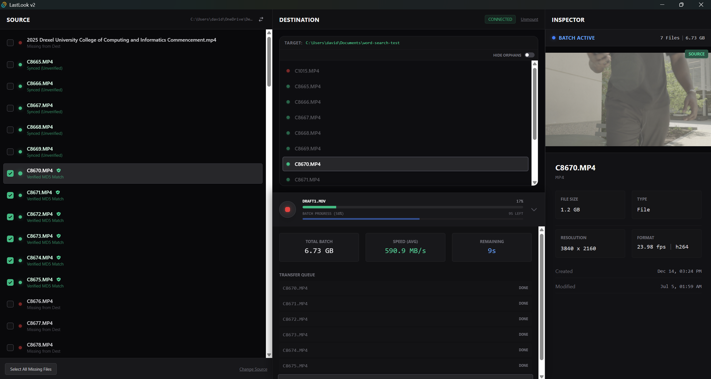

# LastLook v2

**LastLook** is a specialized file transfer and verification tool designed for Filmmakers, DITs, and Content Creators. It combines fast, pipelined file copying with industry-standard **xxHash** verification to ensure your footage is backed up with 100% integrity.



---

## 📥 Download & Install

If you just want to use the app, you don't need to touch any code.

1.  Go to the **[Releases](../../releases)** page on this repository.
2.  Look for the latest version (e.g., `v0.1.0`).
3.  Under **"Assets"**, click to download the Windows Installer:
    - `LastLook_0.1.0_x64_en-US.msi`
4.  Run the installer. Windows might ask for permission since this is an unsigned beta app—click "Run Anyway".

### ⚠️ "Windows protected your PC" Warning?

Because this is an indie app and I haven't paid for a verified Microsoft certificate yet, Windows Defender might show you a warning. This is normal.

To install:

1. Click **"More info"** on the blue popup.
2. Click **"Run anyway"**.

---

## ✨ Key Features

- **xxHash Verification:** Automatically hashes every file during transfer to guarantee an exact bit-for-bit copy.
- **Media Inspector:** View detailed metadata (Codec, FPS, Resolution) and generate thumbnails for video files instantly using a bundled FFmpeg engine.
- **Traffic Light System:** Visual indicators for Verified (Green), Verifying (Yellow), or Orphaned (Red) files.
- **Batch Management:** Select specific files or use "Smart Select" to grab only missing footage.
- **Destructive Safety:** Pre-flight conflict checks prevent you from accidentally overwriting existing media.

---

## 🛠️ Developer Guide

Follow these instructions if you want to clone the repository and build LastLook from source.

### Prerequisites

- **[Node.js](https://nodejs.org/)** (v18+)
- **[Rust](https://www.rust-lang.org/tools/install)** (Latest Stable)
- **[Visual Studio Build Tools](https://visualstudio.microsoft.com/visual-cpp-build-tools/)** (Required for Rust on Windows)

### 1. Clone & Install

```bash
git clone [https://github.com/YOUR_USERNAME/LastLook.git](https://github.com/YOUR_USERNAME/LastLook.git)
cd LastLook
npm install
```

### 2. Setup Sidecar Binaries (Crucial)

LastLook relies on **FFmpeg** and **FFprobe** to generate thumbnails and parse metadata. These binaries are **not** included in the git repo to keep it light. You must add them manually.

1.  Download **FFmpeg Essentials Build** (Windows) from [gyan.dev](https://www.gyan.dev/ffmpeg/builds/) or the official site.
2.  Extract `ffmpeg.exe` and `ffprobe.exe`.
3.  **Rename them** to match the specific Rust target triple (this is required by Tauri):
    - Rename `ffmpeg.exe` → `ffmpeg-x86_64-pc-windows-msvc.exe`
    - Rename `ffprobe.exe` → `ffprobe-x86_64-pc-windows-msvc.exe`
4.  Place both files into the project folder:
    - `src-tauri/binaries/`
      _(Create the `binaries` folder if it doesn't exist)_

### 3. Development Mode

Run the app in debug mode with hot-reloading:

```bash
npm run tauri dev
```

### 4. Build for Production

To generate the `.msi` installer:

```bash
npm run tauri build
```

The output installer will be located in: `src-tauri/target/release/bundle/msi/`

---

## 🏗️ Tech Stack

- **Frontend:** React (TypeScript) + Vite
- **Styling:** Tailwind CSS v4.0
- **State:** Zustand
- **Backend:** Tauri (Rust)
- **Media Engine:** FFmpeg (Static Binary Sidecar)

## 📄 License

This project is licensed under the MIT License - see the [LICENSE](LICENSE) file for details.
